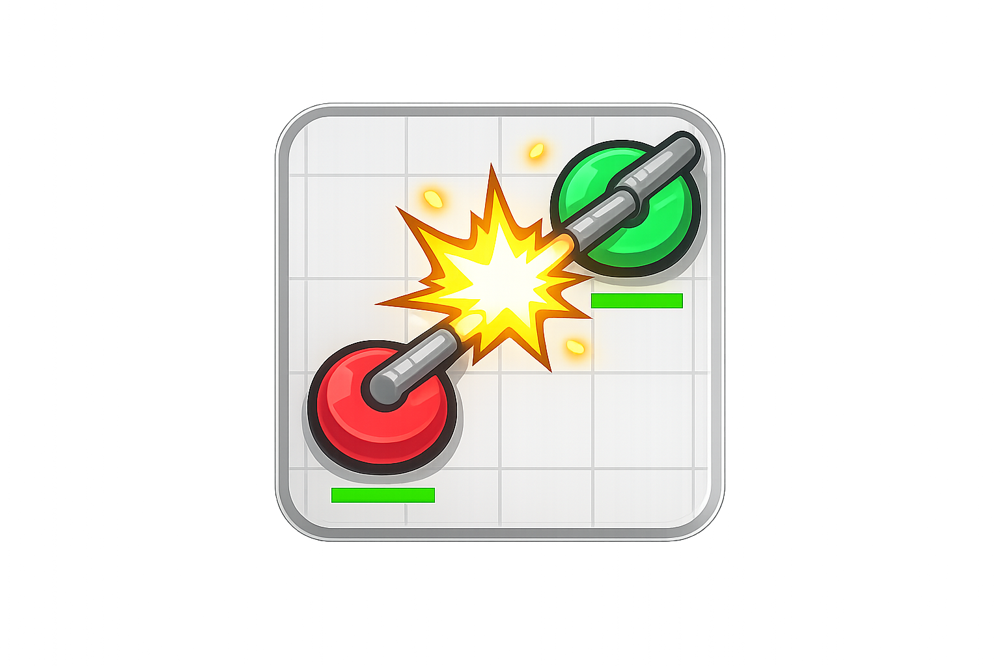
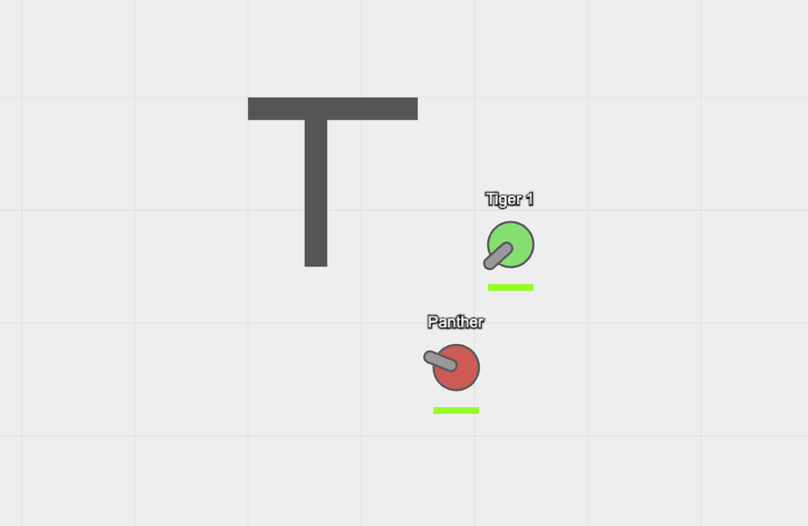

# Tank Battle 2D

A real-time multiplayer 2D tank battle game built with modern web technologies. This version features a scalable monorepo architecture separating client, server, and shared logic.




## Features

- 🎮 **Real-time Multiplayer**: Battle against other players in real-time.
- 🕹️ **Smooth Controls**: Responsive WASD movement and mouse aiming.
- 💥 **Physics-based Gameplay**: Projectile collisions and tank movement handled by a shared physics engine.
- 📱 **Responsive Design**: Playable on various screen sizes with fair viewport scaling.
- 🔗 **Session System**: Create parties and invite friends via links.

## Tech Stack

This project is a monorepo managed with **npm workspaces**.

- **Client** (`packages/client`):
  - [Vite](https://vitejs.dev/) - specialized build tool
  - [Pixi.js](https://pixijs.com/) - 2D rendering engine
  - [Socket.io-client](https://socket.io/) - Real-time communication

- **Server** (`packages/server`):
  - [Node.js](https://nodejs.org/) & [Express](https://expressjs.com/)
  - [Socket.io](https://socket.io/) - WebSocket server
  - [Nodemon](https://nodemon.io/) - Dev server with live reload

- **Shared** (`packages/shared`):
  - Common game logic, constants, physics, and types shared between client and server.

## Prerequisites

- [Node.js](https://nodejs.org/) (v16 or higher recommended)
- [npm](https://www.npmjs.com/) (v7+ required for workspaces)

## Installation

1. Clone the repository:
   ```bash
   git clone <repository-url>
   cd tank-battle-2d
   ```

2. Install dependencies for all packages:
   ```bash
   npm install
   ```

## Development

The project uses npm workspaces to manage scripts from the root directory.

### Start the Client
Runs the Vite development server for the user interface.
```bash
npm run dev:client
```
*Access at `http://localhost:5173` (or port shown in terminal)*

### Start the Server
Runs the Node.js/Express backend with Nodemon.
```bash
npm run start:server
```
*Runs on port `3000` by default*

> **Note**: For multiplayer to work, both the client and server must be running.

## Building for Production

To build the client for production:

```bash
npm run build
```

This will generate the static assets in `packages/client/dist`. The server is configured to serve these static files.

## Project Structure

```
tank-battle-2d/
├── packages/
│   ├── client/    # Frontend application (Pixi.js + Vite)
│   ├── server/    # Backend application (Express + Socket.io)
│   └── shared/    # Shared constants and utility functions
├── package.json   # Root configuration and workspace scripts
└── README.md
```

## License

MIT
